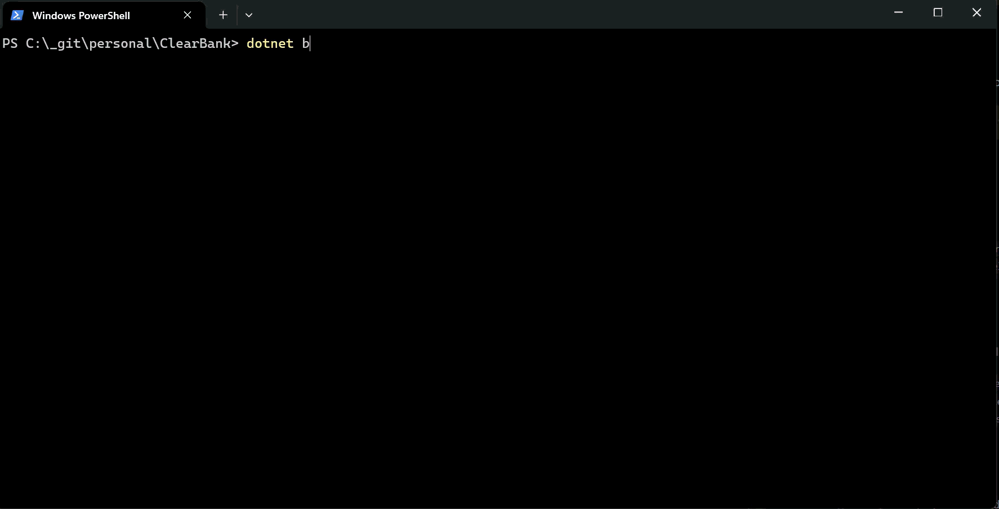
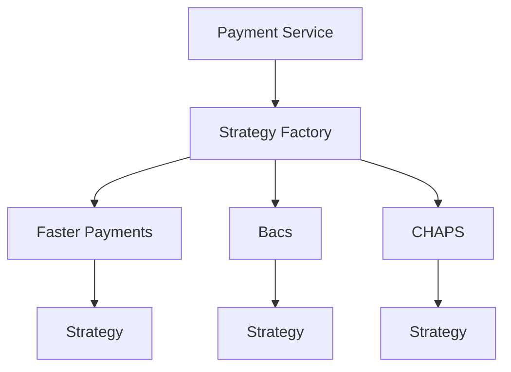

## Test Description
In the 'PaymentService.cs' file you will find a method for making a payment. At a high level the steps for making a payment are:

 - Lookup the account the payment is being made from
 - Check the account is in a valid state to make the payment
 - Deduct the payment amount from the account's balance and update the account in the database
 
What we’d like you to do is refactor the code with the following things in mind:  
 - Adherence to SOLID principals
 - Testability  
 - Readability 

We’d also like you to add some unit tests to the ClearBank.DeveloperTest.Tests project to show how you would test the code that you’ve produced. The only specific ‘rules’ are:  

 - The solution should build.
 - The tests should all pass.
 - You should not change the method signature of the MakePayment method.

You are free to use any frameworks/NuGet packages that you see fit.  
 
You should plan to spend around 1 to 3 hours to complete the exercise.

## Project Structure

- ClearBank.DeveloperTest — The production code for the exercise.
- ClearBank.DeveloperTest.Tests — Unit tests using NUnit, NSubstitute, and FluentAssertions using a [solitary](https://martinfowler.com/bliki/UnitTest.html) style.
- *ClearBank.ComponentTests — Component tests that cover broader system behavior with fewer tests.*

> Note on Component Testing: I am aware the terminology of this sometimes varies, but the definition I opted to follow was the 
> Martin Fowler’s definition of [Component Tests](https://martinfowler.com/bliki/ComponentTest.html). The approach isolates 
> external dependencies and replaces/overrides them with mocks or test doubles with the aim to test the system more broadly. I have also
> known this to be labelled as [Honeycomb Testing](https://engineering.atspotify.com/2018/01/testing-of-microservices) by Spotify.

## Prerequisites
- .NET SDK 8.0 or later installed. Download from: https://dotnet.microsoft.com/en-us/download

> Note: I was going to update this to .NET 9 but opted not to as I wasn't sure whether this was allowed.

## Building the Solution
From the repository root:

- Restore dependencies: `dotnet restore`
- Build all projects: `dotnet build -c Release`

## Running Tests
You can run tests for each project individually or all together.

- Run all tests in the solution: `dotnet test -c Release`
- Run only unit tests: `dotnet test ./ClearBank.DeveloperTest.Tests -c Release`
- Run only component tests: `dotnet test ./ClearBank.ComponentTests -c Release`

## Approach
- Initially, start by identifying I/O calls and inject them in via a new constructor.
- Keep the default constructor to maintain backwards compatibility with existing usage.
- Add component tests to enable safer refactoring and faster feedback on end-to-end behavior (excluding I/O).
- Simplify the service by introducing strategies and a factory to improve readability and maintainability. More importantly adhering to SOLID principles.

> Note: I completed the exercise over two days. I was aiming to complete this in one sitting but had family commitments I needed to attend
> to so I ended dividing the hours over a couple of days.

## Notes and Assumptions
- I utilised Dot Cover to understand the code coverage of the tests.
- Data Stores although do not exist in this exercise or at least not making I/O calls, I assumed they would be so extracted interfaces based on their current state. 
- I did not make any breaking changes and to maintain backwards compatibility I kept the default constructor to look up configuration etc but this pathway is not tested.
- I used .NET 8 as the exercise was authored in this version.
- I downgraded FluentAssertions to 7.2 (pre V8) as V8 and beyond became commercial.
- There was a moment where I could have used `KeyedServices` or introduce two different queries for account lookup but 
I opted to not do this as and ended going directly with a factory. Arguably, I could have taken smaller steps and 
gradually move towards a factory but I opted to keep it simple.